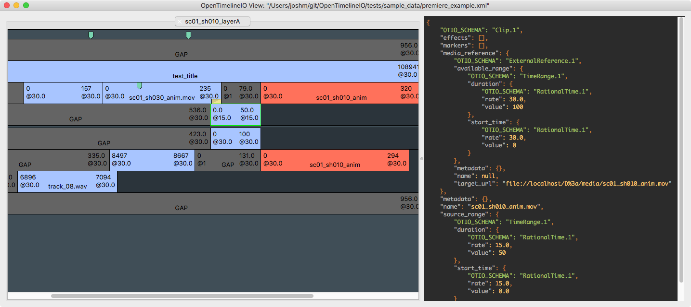

OpenTimelineIO
=======
[](http://opentimeline.io)
==============

[](http://www.vfxplatform.com/)

[](https://github.com/AcademySoftwareFoundation/OpenTimelineIO/actions/workflows/python-package.yml)
[](https://codecov.io/gh/AcademySoftwareFoundation/OpenTimelineIO)
[](https://opentimelineio.readthedocs.io/en/latest/index.html)
[](https://bestpractices.coreinfrastructure.org/projects/2288)

Links
-----

* Main web site: http://opentimeline.io/
* Documentation: https://opentimelineio.readthedocs.io/
* GitHub: https://github.com/AcademySoftwareFoundation/OpenTimelineIO
* [Discussion group](https://lists.aswf.io/g/otio-discussion)
* [Slack channel](https://academysoftwarefdn.slack.com/messages/CMQ9J4BQC)
  * To join, create an account here first: https://slack.aswf.io/
* [Presentations](https://github.com/AcademySoftwareFoundation/OpenTimelineIO/wiki/Presentations)

PUBLIC BETA NOTICE
------------------

OpenTimelineIO is currently in Public Beta. That means that it may be missing
some essential features and there are large changes planned. During this phase
we actively encourage you to provide feedback, requests, comments, and/or
contributions.

Overview
--------

OpenTimelineIO is an interchange format and API for editorial cut information.
OTIO contains information about the order and length of cuts and
 references to external media. It is not however, a container format for media.

For integration with applications, the core OTIO library is implemented in C++
and provides an in-memory data model, as well as library functions for
interpreting, manipulating, and serializing that data model. Within the core is
a dependency-less library for dealing strictly with time, `opentime`.

The project also supports an official python binding, which is intended to be
an idiomatic and ergonomic binding for python developers.  The python binding
includes a plugin system which supports a number of different types of plugins,
most notably adapters, which can be used to read and write legacy formats into
the OTIO data model.

Documentation
--------------
Documentation, including quick start, architecture, use cases, API docs, and much more, is available on [ReadTheDocs](https://opentimelineio.readthedocs.io/)

Supported VFX Platforms
-----------------
The current release supports:
- VFX platform 2023, 2022, 2021, 2020
- Python 3.7 - 3.10

For more information on our vfxplatform support policy: [Contribution Guidelines Documentation Page](https://opentimelineio.readthedocs.io/en/latest/tutorials/contributing.html)
For more information on the vfxplatform: [VFX Platform Homepage](https://vfxplatform.com)

Adapter Plugins
---------------

To provide interoperability with other file formats or applications lacking a
native integration, the opentimelineio community has built a number of python
adapter plugins. This includes Final Cut Pro XML, AAF, CMX 3600 EDL, and more.

For more information about this, including supported formats, see: https://opentimelineio.readthedocs.io/en/latest/tutorials/adapters.html

Other Plugins
-------------

The OTIO python bindings also support several other kinds of plugins, for more information see:

* [Media Linkers](https://opentimelineio.readthedocs.io/en/latest/tutorials/write-a-media-linker.html) - Generate media references to local media according to your local conventions.
* [HookScripts](https://opentimelineio.readthedocs.io/en/latest/tutorials/write-a-hookscript.html) - Scripts that can run at various points during OTIO execution (_ie_ before the media linker)
* [SchemaDefs](https://opentimelineio.readthedocs.io/en/latest/tutorials/write-a-schemadef.html) - Define OTIO schemas.

Installing / Quick-Start
------------------------

The Python-wrapped version of OpenTimelineIO is publicly available [via PyPI](https://pypi.org/project/OpenTimelineIO/).  You can install OpenTimelineIO via:

`python -m pip install opentimelineio`

For detailed installation instructions and notes on how to run the included viewer program, see: https://opentimelineio.readthedocs.io/en/latest/tutorials/quickstart.html


Example Usage
-------------

C++:

```c++
#include <iostream>

#include "opentimelineio/timeline.h"

namespace otio = opentimelineio::OPENTIMELINEIO_VERSION;

void
main()
{
    otio::ErrorStatus err;
    otio::SerializableObject::Retainer<otio::Timeline> tl(
            dynamic_cast<otio::Timeline*>(
                otio::Timeline::from_json_file("taco.otio", &err)
        )
    );
    const std::vector<otio::SerializableObject::Retainer<otio::Clip>> clips = (
            tl->clip_if()
    );
    for (const auto& cl : clips)
    {
        otio::RationalTime dur = cl->duration();
        std::cout << "Name: " << cl->name() << " [";
        std::cout << dur.value() << "/" << dur.rate() << "]" << std::endl;
    }
}
```

Python:

```python
import opentimelineio as otio

timeline = otio.adapters.read_from_file("foo.aaf")
for clip in timeline.clip_if():
  print(clip.name, clip.duration())
```

There are more code examples here: https://github.com/AcademySoftwareFoundation/OpenTimelineIO/tree/main/examples

Also, looking through the unit tests is a great way to see what OTIO can do:
https://github.com/AcademySoftwareFoundation/OpenTimelineIO/tree/main/tests

OTIO includes a viewer program as well (see the quickstart section for instructions on installing it):



Developing
----------

If you want to contribute to the project, please see: https://opentimelineio.readthedocs.io/en/latest/tutorials/contributing.html

You can get the latest development version via:

`git clone git@github.com:AcademySoftwareFoundation/OpenTimelineIO.git --recursive `

You can install development dependencies with `python -m pip install .[dev]`

You can also install the PySide2 dependency with `python -m pip install .[view]`

You may need to escape the `[` depending on your shell, `\[view\]` .

Currently the code base is written against python 3.7, 3.8, 3.9, 3.10 and 3.11,
in keeping with the pep8 style.  We ask that before developers submit pull
request, they:

- run `make test` -- to ensure that none of the unit tests were broken
- run `make lint` -- to ensure that coding conventions conform to pep8
- run `make coverage` -- to detect code which isn't covered

PEP8: https://www.python.org/dev/peps/pep-0008/

For advanced developers, arguments can be passed to CMake through the pip
commandline by using the `CMAKE_ARGS` environment variable.

*nix Example:

`env CMAKE_ARGS="-DCMAKE_VAR=VALUE1 -DCMAKE_VAR_2=VALUE2" pip install .`

Additionaly, to reproduce CI failures regarding the file manifest, run:
`make manifest` locally to run the python `check-manifest` program.

## C++ Coverage Builds

To enable C++ code coverage reporting via gcov/lcov for builds, set the
following environment variables:

- `OTIO_CXX_COVERAGE_BUILD=ON`
- `OTIO_CXX_BUILD_TMP_DIR=path/to/build/dir`

When building/installing through `pip`/`setup.py`, these variables must be set
before running the install command (`python -m pip install .` for example).

License
-------
OpenTimelineIO is open source software. Please see the [LICENSE.txt](LICENSE.txt) for details.

Nothing in the license file or this project grants any right to use Pixar or any other contributor’s trade names, trademarks, service marks, or product names.

Contact
-------

For more information, please visit http://opentimeline.io/
or https://github.com/AcademySoftwareFoundation/OpenTimelineIO
or join our discussion forum: https://lists.aswf.io/g/otio-discussion

