---
html:
  embed_local_images: true
  embed_svg: true
  offline: true
  toc: true
toc:
  depth_from: 1
  depth_to: 3
print_background: false
---

# OTIO Core Data Model Specification

## Introduction (informative)

This document specifies the core OTIO data model, as illustrated below.

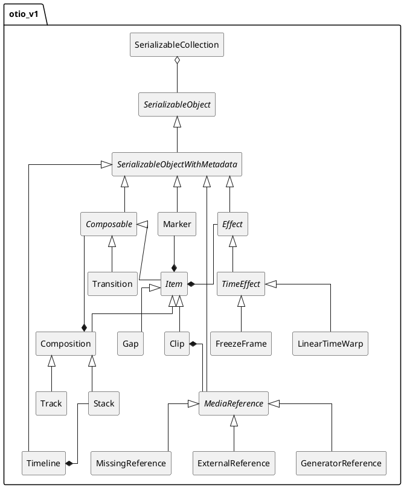

## Object Model

### SerializableObject {#object-model-SerializableObject}

#### Introduction (informative)

Superclass for all classes whose instances can be serialized.

#### General

```puml
@startuml
hide empty members
skinparam classAttributeIconSize 0

interface SerializableObject {
}

@enduml
```

_NOTE_: The `schema_name()` and `schema_version()` method of the reference implementation are serialization-specific. `schema_name()` can be derived from the class name and `schema_version()` can be derived from the version of the specifications defining the class.

### SerializableObjectWithMetadata {#object-model-SerializableObjectWithMetadata}

#### Introduction (informative)

#### General

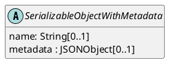

#### name

This property identifies the object.

_NOTE_: This property is intended for human consumption and there are no uniqueness requirements for its value.

#### metadata

This property contains information that further describes the object.

### SerializableCollection {#object-model-SerializableCollection}

#### General

#### Introduction (informative)

A `SerializableCollection` object represents a generic container of other objects.

No timing relationship between its `children` objects is implied, in contrast to a `Composition` for example.

_EXAMPLES_: A bin of media, a bundle of timelines in a single file. Specifically, the AAF adapter will output a SerializableCollection that contains multiple Timelines when reading an AAF that contains multiple compositions. Also, the ALE adapter outputs a SerializableCollection of Clips. For some workflows a SerializableCollection and a Track could be used interchangably in practice, but we wanted SerializableCollection to be more generic and able to hold non-Composable objects like Markers, etc.

#### General

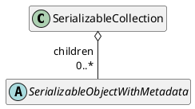

#### children

This property defines the timeline of the object.

### Timeline {#object-model-Timeline}

#### Introduction (informative)

A `Timeline` object represents a complete project. The media timeline of the object is referenced by its `tracks` property.

#### General

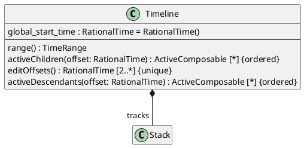

_EDITOR'S NOTE_: Why can't `Timeline` derive from `Stack`?

#### tracks

This property defines the timeline of the object.

#### global_start_time

This property indicates the start of the object's timeline from the start of the timeline defined by the `tracks` property.

_EDITOR'S NOTE_: What is exactly `global_start_time`? What is it relative to?

#### range()

This method returns the interval `[global_start_time, tracks.range().duration())`.

#### activeChildren()

This method returns `tracks.activeChildren(offset)`.

#### editOffsets()

This method returns `tracks.editOffsets(offset)`.

#### activeDescendants()

This method returns `tracks.activeDescendants(offset)`;

### Stack {#object-model-Stack}

#### Introduction (informative)

A `Stack` represents a collection of chidren `Composable` objects that are arranged such that their start times are coincident.

Most commonly, this would be a series of `Track` objects that contain `Clip` objects. The 0-time of those `Track` objects would be coincide with the 0-time of the `Stack` object.

The children objects are in compositing order, with later (towards top) children obscuring earlier (towards bottom) children. If a `Stack` object has three children, [A, B, C], C is above B which is above A.

The duration of a `Stack` is the duration of its longest child.  If a child ends before the other children, then an earlier index child would be visible before it.

The timing model of a `Stack` object is illustrated below.

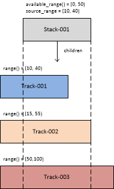


#### General

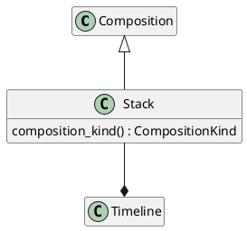

#### composition_kind()

The method returns `CompositionKind::Stack`.

### Track {#object-model-Track}

#### Introduction (informative)

A `Track` represents a collection of chidren `Composable` objects that are arranged sequentially in time.

The duration of a `Track` is the sum of the duration of its children.

The timing model of a `Track` object is illustrated below.

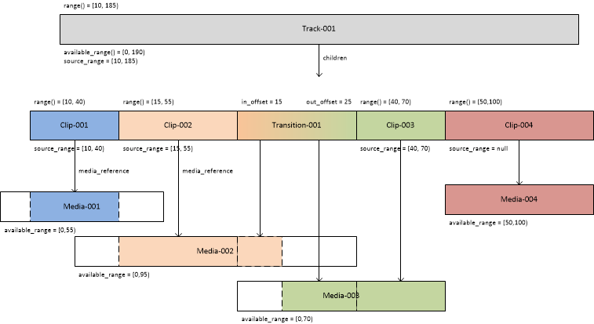

#### General

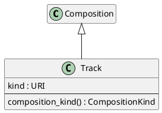

#### kind

This property uniquely identifies the kind of essence produced by the `Track`.

The following table defines common values.

Kind of essence | URI
------------ | -------------
Video | _TBD_
Audio | _TBD_

_EDITOR'S NOTE_: is a `track` always have only of a single kind?

#### composition_kind()

The method returns `CompositionKind::Track`.

### Composable {#object-model-Composable}

#### Introduction (informative)

A `Composable` object defines a media timeline over a temporal range.

#### General

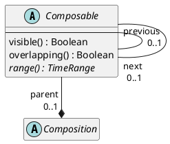

#### parent

This property contains a reference to the parent of the object.

_EDITOR'S NOTE_: `self.parent` is `null` when the `Composable` object is a child of a `SerializableCollection`.

#### previous

This property references the previous sibling of the object in the `parent`, if one exists.

#### next

This property references the next sibling of the object in the `parent`, if one exists. 

#### visible()

This method indicates whether the object is visible.

This method returns `false`.

_EDITOR'S NOTE_: The inline code documentation is inconsistent. Does "visible" mean "produce visible output" or "contributes to the timeline" or ...? It looks like this is used only for the stacking algorithm... but how does it apply to audio tracks?

#### overlapping()

This method indicates whether the object is overlapping.

This method returns `false`.

_EDITOR'S NOTE_: It looks like this is primarily used in the code to differentiate `Item` and `Transition` objects. Why not differentiate them based on their root classes, or is it possible for an `Item` object to be overlapping?

#### range()

This method returns the temporal interval over which the object timeline is defined.

### Item {#object-model-Item}

#### Introduction (informative)

An `Item` object positions media on a media timeline. It can also hold effects (`Effect` objects) and markers (`Marker` objects).

#### General

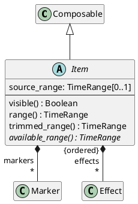

#### source_range

This property modifies the interval of the object timeline -- see `range()`.

_NOTE_: Usually `source_range` is within `self.available_range()` but this is not a requirement. Some use cases will intentionally ask for a `Clip` that is longer (or starts earlier) than the available media as a way to request that new media (a newly animated take, or newly recorded audio) be made to fill the requested `source_range`.

#### effects

This property specifies `Effect` objects applied, in order, to the `Item`.

_EDITOR'S NOTE_: Why are effects and transitions different?

#### markers

This property specifies `Marker` objects associated with the object.

#### visible()

This method returns returns `true`.

#### available_range()

This method returns the temporal range over which media is available.

_NOTE_: This method always returns a valid `TimeRange` object.

#### range()

This method returns:

* `self.source_range`, if `self.source_range` is not `null`; or
* `self.available_range()`, otherwise.

#### trimmed_range()

This method returns `self.range()`.

_EDITOR'S NOTE_: Suggest replacing `trimmed_range()` with `range()`, which applies to `Item` objects as well as `Transition` objects.

### Effect {#object-model-Effect}

#### General

This class represents an effect applied to its parent `Item`.

```puml
@startuml
hide empty members
skinparam classAttributeIconSize 0

abstract class Effect {
  --
  {abstract} effect_name() : String
}

@enduml
```

_NOTE_: Effect specialization is handled as subclasses since they affect timing, whereas transition and generators are handled as paramterized classes.

_EDITOR'S NOTE_: Should there be a `properties` property like with `Transition`.

#### effect_name()

Returns a human-readable name for the effect.

_EXAMPLE_: `"Blur"`, `"Crop"`, `"Flip"`.

### TimeEffect {#object-model-TimeEffect}

Parent class for `Effect` objects that manipulate time.

```puml
@startuml
hide empty members
skinparam classAttributeIconSize 0

abstract class TimeEffect

abstract class Effect

Effect <|-- TimeEffect

@enduml
```

### LinearTimeWarp {#object-model-LinearTimeWarp}

#### General

A time warp that applies a linear scale across the entire parent `Item`.

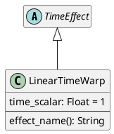

#### time_scalar

Linear time scalar applied to clip.

_EXAMPLE_: `timescalar = 2.0` means double speed, and `timescalar = 0.5` means half speed.

#### effect_name()

This method returns `"LinearTimeWarp"`.

### FreezeFrame {#object-model-FreezeFrame}

#### General

This effect holds the first frame of the item for the duration of the parent `Item`.

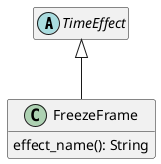

#### effect_name()

This method returns `"FreezeFrame"`.

### Marker {#object-model-Marker}

#### General

This class holds metadata over time on a timeline.

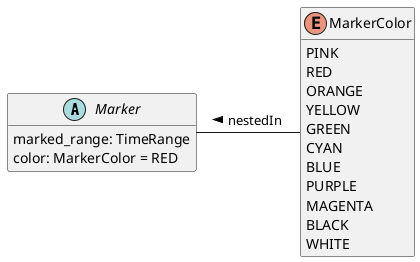

_EDITOR'S NOTE_: Should `MarkerColor` allow any sRGB color value?

#### marked_range

Range this marker applies to, relative to the Item this marker is attached to (e.g. the Clip or Track that owns this marker).

#### color

Color of the `Marker` object.

### Transition {#object-model-Transition}

#### General

A `Transition` object corresponds to an overlap between the previous and next `Item` objects in a `Track` objects. In common usage this is a video cross-dissolve, wipe, audio cross-fade, or blend between two `Clip` objects.

The timeline of the `Transition` object `obj` corresponds to the temporal transition from the first to second of the following coterminous intervals:

* the interval `[obj.previous.range.end - obj.in_offset, obj.previous.range.end - obj.in_offset + obj.range().duration())` within the timeline of `obj.previous`, if it exists; and
* the interval `[obj.next.range.start - obj.out_offset, obj.next.range.start - obj.out_offset + obj.range().duration())` within the timeline of `obj.next`, if it exists.

_NOTE_: Coterminous means that the two intervals overlap from start to end.

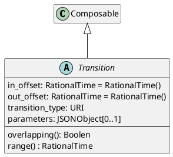

_EDITOR'S NOTE_: It is surprising that a transition at the start or end of a track generates a `Gap` whose duration is equal to `in_offset` or `out_offset` respectively, so that the duration of the `Track` is increased implicitly, but no `Gap` is generated when `in_offset` is larger than the previous sibling.

_EDITOR'S NOTE_: `in_offset` and `out_offset` should not be allowed to be `null`.

#### in_offset

This property specifies the temporal overlap with the previous `Item` in the parent `Composition` object.

`self.in_offset` shall be equal to or greater than 0.

If `self.previous` is not `null`, then `self.in_offset` shall be smaller than or equal to `self.previous.range().duration()`.

#### out_offset

This property specifies the temporal overlap with the next `Item` in the parent `Composition` object.

`self.out_offset` shall be equal to or greater than 0.

If `self.next` is not `null`, then `self.out_offset` shall be smaller than or equal to `self.next.range().duration()`.

#### transition_type

This property identifies the kind of transition applied by the object.

#### parameters

This property specifies parameters for the transition applied by the object.

#### next

`self.next` shall be an `Item` object or `null`.

#### previous

`self.previous` shall be an `Item` object or `null`.

#### overlapping()

This method returns `true`.

#### range()

This method returns the interval `[0, self.out_offset + self.in_offset)`.

### Gap {#object-model-Gap}

#### General

This class represents the absence of media.

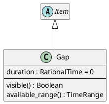

#### visible()

This method returns `false`.

#### available_range()

The method returns the interval `[0, duration)`.

### Clip {#object-model-Clip}

#### Introduction (informative)

A `Clip` object positions the media referenced by the `media_reference` property on its timeline.

#### General

A temporal offset `t` in the object timeline corresponds to the temporal offset `t` into the media referenced by the `media_reference` property.

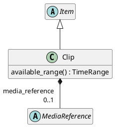

#### available_range()

The method returns:

* a copy of `self.media_reference.available_range` if `self.media_reference` is not `null` and `self.media_reference.available_range` is not `null`; or
* a new `TimeRange`, otherwise.

_EDITOR'S NOTE_: A zero-duration `TimeRange` is returned if the actual `available_range` of the underlying media is unknown.

#### media_reference

This property references the media associated with the object.

### MediaReference {#object-model-MediaReference}

#### General

This class identifies media to be placed on the timeline.

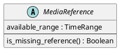

#### available_range

This property indicates the temporal interval of media available.

#### is_missing_reference()

This method indicates whether the media underlying the reference is available (`is_missing_reference() === false`) or missing (`is_missing_reference() === true`).

This method returns `false`.

### ExternalReference {#object-model-ExternalReference}

#### General

Reference to media via a URI.

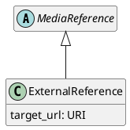

#### target_url

This property is a URI to the media.

### GeneratorReference {#object-model-GeneratorReference}

#### General

Generators are media references that become "generators" in editorial systems.  For example, color bars or a solid color.

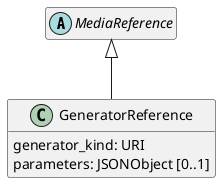

#### generator_kind

This property identifies the operation of the generator.

#### parameters

This property specifies parameters to be provided to the generator.

### MissingReference {#object-model-MissingReference}

#### General

This class represents media for which a concrete reference is missing.

```puml
@startuml
hide empty members
skinparam classAttributeIconSize 0

abstract class MediaReference

MediaReference <|-- MissingReference

class MissingReference {
  is_missing_reference() : Boolean
}

@enduml
```

#### is_missing_reference()

This method returns `true`.

### Composition {#object-model-Composition}

#### Introduction

A `Composition` object arranges children `Composable` objects onto its timeline.

#### General

```puml
@startuml
hide empty members
skinparam classAttributeIconSize 0

Item <|-- Composition

abstract class Composition {
  {abstract} composition_kind() : CompositionKind
  available_range() : TimeRange
  activeChildren(offset: RationalTime) : ActiveComposable [*] {ordered}
  editOffsets() : RationalTime [2..*] {unique}
  activeDescendants(offset: RationalTime) : ActiveComposable [*] {ordered}
}

enum CompositionKind {
  Stack
  Track
}

Composition *-down- " children\r * {ordered}" Composable

CompositionKind -right- Composition : nestedIn >

@enduml
```

_EDITOR'S NOTE_: `CompositionKind` is unnecessary and all Stack-like (Track-like) objects should derive from `Stack` (`Track`)

#### composition_kind()

The method returns the timing model of the object.

#### available_range()

The method returns the interval  `[self.editOffsets()->first(), self.editOffsets()->last())`.

#### activeChildren()

_NOTE_: This method returns the children of the object that are active at offset `offset` within the object's timeline.

* set `children` to an empty list

* if `self.compositionKind() = CompositionKind::Stack`, then run the following steps for each element `child` of `self.children`, in order:
  * set `active` to a new `ActiveComposable`
  * set `active.composable` to a reference to `child`
  * set `active.offset` to a reference to `offset`
  * append `active` to `children`

* otherwise, if `self.compositionKind() = CompositionKind::Track`, then:
  * set `current_offset` to a new `RationalTime()`
  * run the following steps for each element `child` of `self.children`, in order:
    * if `offset >= current_offset && offset < current_offset + child.range().duration`:
      * set `active` to a new `ActiveComposable`
      * set `active.composable` to a reference to `child`
      * set `active.offset` to a new `offset - current_offset + child.range().start`
      * append `active` to `children`
      * break
    * set `current_offset` to `current_offset + child.range().duration()`

* return `children`

#### activeDescendants()

_NOTE_: This method returns the all descendents of the object that are active at offset `offset` within the object's timeline.

* let `actives` be an empty sequence of `ActiveComposable`

* let `children` be equal to `activeChildren(offset)`

* run the following steps for each element `child` of `children`, in order:
  * if `child.composable` is a `Composition` then append the return value of `child.composable.activeDescendants(child.offset)` to `actives`.
  * if `child.composable` is not a `Composition` then append `child` to `actives`.

* return `actives`;

#### editOffsets()

_NOTE_: This method return the temporal offsets within the object's timeline where children, if any, become active or inactive.

* set `points` to an empty set of `RationalTime`

* append a new `RationalTime(0)` to `points`

* if `self.compositionKind() = CompositionKind::Stack`, then:
  * run the following steps for each element `child` of `self.children`, in order:
    * if `child.range().duration()` is not a member of `points`:
      * append `child.range().duration()` to `points`

* otherwise, if `self.compositionKind() = CompositionKind::Track`, then:
  * run the following steps for each element `child` of `self.children`, in order:
    * set `current_offset` to `current_offset + child.range().duration()`
    * append `current_offset` to `points`

* return `points`

## Datatypes

### ActiveComposable

```puml
@startuml
hide empty members
skinparam classAttributeIconSize 0

class ActiveComposable <<datatype>> {
  composable: Composable
  offset: RationalTime
}

@enduml
```

Indicates that the `Composable` object at `self.composable` is active at offset `self.offset`.

### RationalTime

```puml
@startuml
hide empty members
skinparam classAttributeIconSize 0

class RationalTime <<datatype>> {
  numerator : Integer = 0
  denominator : Integer = 1
}

@enduml
```

Number equal to the ratio of `numerator` over `denominator`.

### Boolean

```puml
@startuml
hide empty members
skinparam classAttributeIconSize 0

class Boolean <<datatype>>

@enduml
```

`true` or `false`.

### String

```puml
@startuml
hide empty members
skinparam classAttributeIconSize 0

class String <<datatype>>

@enduml
```

UTF-8 string.

### URI

```puml
@startuml
hide empty members
skinparam classAttributeIconSize 0

class URI <<datatype>>

@enduml
```

URI as specified in RFC 3986.

### Integer

```puml
@startuml
hide empty members
skinparam classAttributeIconSize 0

class Integer <<datatype>>

@enduml
```

Integer in the range [- 2<sup>63</sup>, 2<sup>63</sup> - 1].

### Float

```puml
@startuml
hide empty members
skinparam classAttributeIconSize 0

class Float <<datatype>>

@enduml
```

Double (binary64) floating point number as defined in IEEE 754.

### JSONObject

```puml
@startuml
hide empty members
skinparam classAttributeIconSize 0

class JSONObject <<datatype>>

@enduml
```

A JSON Object as defined at www.json.org.

### TimeRange

#### General

```puml
@startuml
hide empty members
skinparam classAttributeIconSize 0

class TimeRange <<datatype>> {
  start : RationalTime = 0
  end : RationalTime = 0
  --
  <<constructor>> TimeRange(start : RationalTime, end : RationalTime)
  <<constructor>> TimeRange(end : RationalTime)
  ..
  duration() : RationalTime
}

@enduml
```

The temporal interval [start, end).

#### TimeRange(start : RationalTime, end : RationalTime)

This constructor executes the following:

* `self.start = start`
* `self.end = end`

#### TimeRange(end : RationalTime)

This constructor executes the following:

* `self.start = new RationalTime()`
* `self.end = end`

#### duration()

This method returns `self.end - self.start`.

## Timing Model

An offset `t` in the timeline of a `Timeline` object `obj` is mapped to an offset in all its active descendant `Item` and `Clip` objects returned by `obj.activeDescendents(t)`.