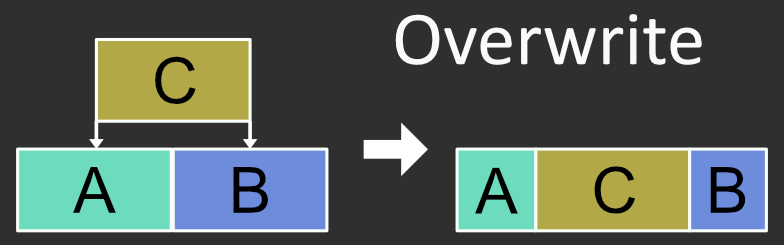
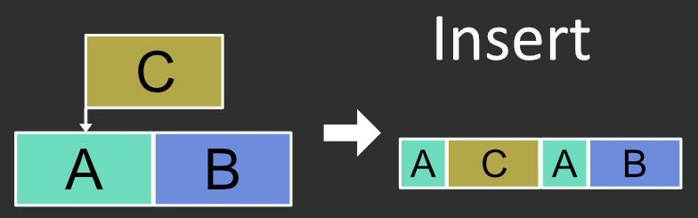
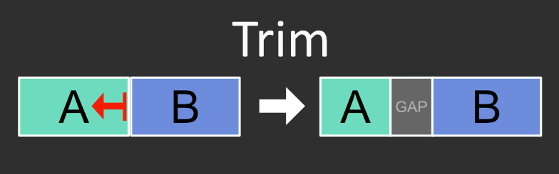
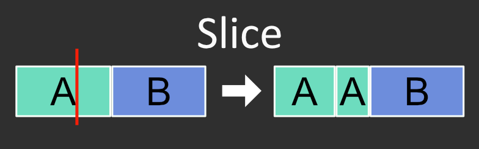
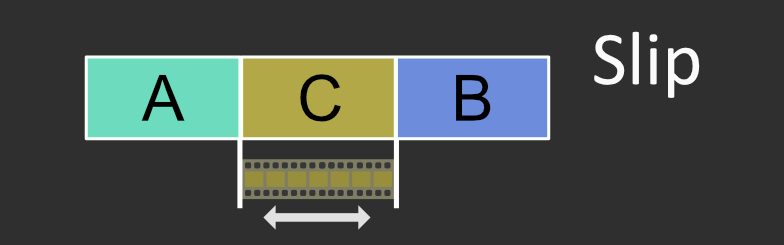
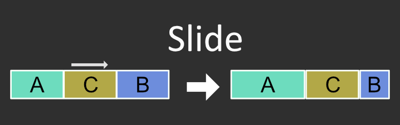
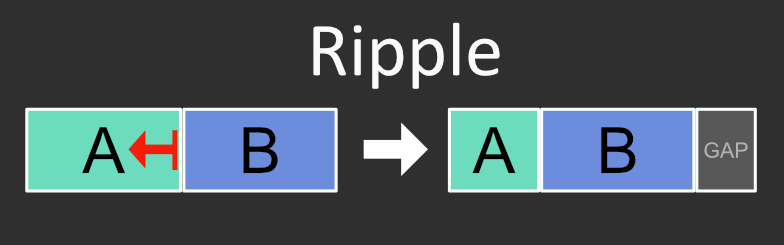
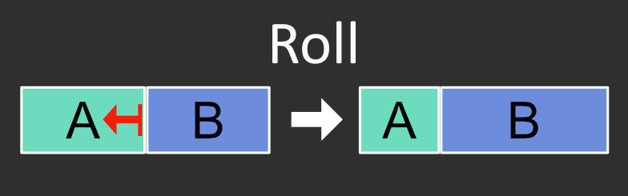
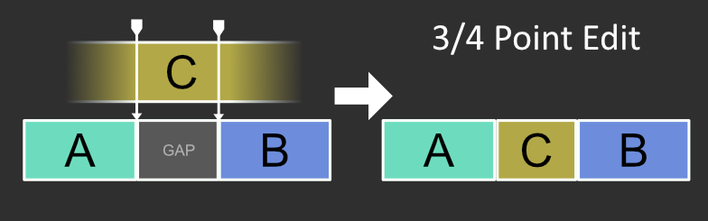

Designing an Edit API
=====================

# Design Overview
The industry is full of timeline management software but nearly all of them include a fundamental set of tools for manipulation. OpenTimelineIO includes a suite of tools for operating on objects as raw data structures (append, etc), but is missing a library for performing higher level operations familiar to people from the editing world (Slip, 3/4 point edit, etc). This proposal presents an API for working with OpenTimelineIO objects in those ways.

## Audience

1. The implementer(s) of the API
2. Future users of the API - TDs and DCC developers
3. Future Maintainers


## Structure
The underlying implementation for these edit commands will be in C++, under the `opentimelineio/algo` directory.

```
OpenTimelineIO/
    `- src/
        `- opentimelineio/
            `- algo/
                `- ...
```

## Schemas
The editing toolkit will only posses the ability to modify and work with OpenTimelineIO `Schema` objects but will not host any of it's own. All core models should be defined elsewhere.

### Retainer
Ideally, we continue to use the `Retainer<>` where possible to make sure editing is reference counted. Namespaces might make the names a bit clunky, seeing `SerializedObject::Retainer<>` all over so establishing aliases early on will be beneficial.

```
using RetainedItem = SerializedObject::Retainer<Item>;
using RetainedComposition = SerializedObject::Retainer<Composition>;
...
```

# Editing Commands
Let's go through some of the most common commands and what the python API might look like:

## Overwrite


- Because this handles multiple scenarios, please refer to the ASCII art below for the various scenarios

#### API
```py
"""
Args:
    item: Item that we're going to place onto the track
    track: Track that this item will belong to afterwards
    track_time: RationalTime of our track to put this item at
    fill_template: Optional[Item] that will be cloned where required
        to fill in the event that this overwrite extends the end of the
        track's current duration

Scenarios:
    let item = C
    let track_item = 10 @ 24

    ---
    1 - Item overlaps "GAP" and "A", contains "B"

            [0        C         40]
    0       |                                     N
    | ------------------------------------------- |
    | [0    GAP  20][0  B  10][0     A    30]     |
    | ------------------------------------------- |
    
    RESULT
        - "C" inserted after "GAP"
        - "B" Removed
        - "GAP" duration changed
        - "A" source start + duration changed
    | ------------------------------------------- |
    | [GAP ][0       C        40][10  A  30]      |
    | ------------------------------------------- |

    ---
    2 - Item is contained by track item "A"

            [0        C         40]
    0       |                                     N
    | ------------------------------------------- |
    | [0               A                50]       |
    | ------------------------------------------- |

    RESULT
        - "A" split at track_time (See documentation below for procedure)
        - "A'" source_range start = "A" source_range end + "C" duration
        - "C" inserted after "A"
    | ------------------------------------------- |
    | [ A 10][0        C         40][40 A' ]      |
    | ------------------------------------------- |

    ---
    3 - Item is passed tracks current duration
            [0        C         40]
    0       |                                     N
    | ------------------------------------------- |
    | <nothing>                                   |
    | ------------------------------------------- |

    RESUT
        - Fill template cloned to fill empty space
    | ------------------------------------------- |
    | [ FILL ][0        C         40]             |
    | ------------------------------------------- |
"""
otio.algorithms.overwrite(
    item: Item,
    track: Track,
    track_time: RationalTime,
    fill_template: Item = None, # Default to Gap
)
```
- In the image, Clip `C` is `item` and `track` is the what `A` and `B` are on.

----

## Insert

- Item placed at track_time
- Items past the in point are shifted by the new items duration.
- Item may be split if required.

#### API
```py
"""
Args:
    <same as overwrite>

Scenarios:
    let item = C
    let track_time = 10 @ 24

    1 - Item overlaps "GAP" and "A", contains "B"

            [0        C         40]
    0       |                                     N
    | ------------------------------------------- |
    | [0    GAP  20][0  B  10][0     A    30]     |
    | ------------------------------------------- |
    
    RESULT
        - "GAP" split at track_time
        - Existing "GAP" duration reduced
        - New "GAP" duration adjusted to fit the rest
        - "C" inserted into track children after existing GAP
        - "B" and "A" left unchanged
    | ------------------------------------------- |
    | [GAP ][0       C        40][10 GAP 20][0    B ... <continued>
    | ------------------------------------------- |


    2 - Item is passed tracks current duration (eqiv to overwrite)
            [0        C         40]
    0       |                                     N
    | ------------------------------------------- |
    | <nothing>                                   |
    | ------------------------------------------- |

    RESUT - Fill template cloned to fill empty space
    | ------------------------------------------- |
    | [ FILL ][0        C         40]             |
    | ------------------------------------------- |
"""
otio.algorithms.insert(
    item: Item,
    track: Track,
    track_time: RationalTime,
    fill_template: Item = None, # Default to Gap
)
```

---

## Trim

- Adjust a single item's start time or duration.
- Do not affect other clips.
- Fill now-"empty" time with gap or template
  - Unless item is meeting a Gap, then, existing Gap's duration will be augmented
- Clamps source_range to non-gap boundary (can only overwrite gaps)

#### API
```py
"""
Args:
    item: Item to apply trim to
    delta_in: RationalTime that the item's source_range().start_time()
        will be adjusted by
    delta_out: RationalTime that the item's
        source_range().end_time_exclusive() will be adjusted by

Scenarios:
    let item = A
    
    Given:
    | ------------------------------------------- |
    | [0    GAP  20][5     A      50][0   B   10] |
    | ------------------------------------------- |

    1. +delta_in
    let delta_in = 5 @ 24
        - "A" source start and duration adjusted
        - "GAP" duration augmented
    | ------------------------------------------- |
    | [0    GAP    25][10   A     50][0   B   10] |
    | ------------------------------------------- |

    2. -delta_in
    let delta_in = -5 @ 24
        - "A" source start and duration adjusted
        - "GAP" duration augmented by delta_out
    | ------------------------------------------- |
    | [0  GAP  15][0       A      50][0   B   10] |
    | ------------------------------------------- |    

    3. +delta_out
    left delta_out = 5 @ 24
        - "B", because it's not a "GAP", blocks "A" from trimming duration
        - EFFECTIVELY NO CHANGES
    | ------------------------------------------- |
    | [0    GAP  20][5     A      50][0   B   10] |
    | ------------------------------------------- |

    4. -delta_out
    left delta_out = -5 @ 24
        - "A" duration augmented by delta_out
        - "FILL" inserted with duration of -delta_out
    | ------------------------------------------- |
    | [0    GAP  20][5   A  45][FILL][0   B   10] |
    | ------------------------------------------- |

"""
otio.algorithms.trim(
    item: Item,
    delta_in: RationalTime = None,   #< Duration of change
    delta_out: RationalTime = None,  #< Duration of change
    fill_template: Item = None,      #< Default to Gap
)
```
**QUESTION:** Should there be an `overwrite=bool` parameter to allow case 3 to push through B? It is not default because that would effectively be a `Roll` edit.

> Not convinced on the argument names for this

---

## Slice

- Generate clone of input item
- Insert clone after original
- Augment both item's source_range.

#### API
```py
"""
Args:
    item: otio.schema.Item - to cut
    at_time: otio.schema.RationalTime - time, based on the
        coordinates to slice at
    coordinates: Enumerator for the variable calculations that
        can be done to the at_time.

Scenarios:
    Let item = A
    let at_time = 25 @ 24fps

    0                                             N
    | ------------------------------------------- |
    | [0    GAP  20][0         A           50]    |
    | ------------------------------------------- |

    if coordinates == Local:
    | ------------------------------------------- |
    | [0    GAP  20][0    A   25][26   A  50]     |
    | ------------------------------------------- |

    if coordinates == Parent:
    | ------------------------------------------- |
    | [0    GAP  20][0 A 5][6      A      50]     |
    | ------------------------------------------- |

    if coordinates == Global:
        - This only matters if the parent is a track in a compound
          stack, at which point we might be better off having the
          user just convert from one time to the other
"""
otio.algorithms.slice(
    item: Item,
    at_time: RationalTime,
    coordinates: otio.algorithms.Coordinates.(Local|Parent|Global*)
)
```
> I'm not sure if we have a coordinate enumerator already?

---


## Slip

- Adjust the start_time of an item's source_range.
- Do not affect item duration.
- Do not affect surrounding items.
- Clamp to available_range of media (if available)

#### API
```py
"""
Args:
    item: Item that we're slipping
    delta: RationalTime to adjust the range by.

Scenarios:
    let item = A
    
    Given:
    | ------------------------------------------- |
    | [0    GAP  20][5     A      50][0   B   10] |
    | ------------------------------------------- |

    ---
    1. +delta
    let delta = 10 @ 24
        - "A" source start augmented by:
            min("A".source_avail.end, "A".source.start + delta)
    | ------------------------------------------- |
    | [0    GAP  20][15    A      60][0   B   10] |
    | ------------------------------------------- |

    ---
    2. -delta
    let delta = -10 @ 24
        - "A" source start augmented by:
            max("A".source_avail.start, "A".source.start + delta)
        - Because "A" only had 5 frames to give, the clamp occurs
    | ------------------------------------------- |
    | [0    GAP  20][0     A      45][0   B   10] |
    | ------------------------------------------- |
"""
otio.algorithms.slip(
    item: Item,
    delta: RationalTime,
)
```
- In the example image, `C` is `item` and `delta` is the arrow's vector.

> Effectively this is already quite simple in the core API but would be nice to have here.

---


## Slide

- Adjust start time of item and trim adjacent items to fill
- Do not change main item's duration, only adjacent
- Clamp to available range of adjacent items (if available)
- Will not remove any item

#### API
```py
"""
Args:
    item: The item to push and pull around, which may in turn affect the
        items around it.
    delta: The delta that we're looking to push this item about.

Scenarios:
    let item = A

    Given:
    | ------------------------------------------- |
    | [0    GAP  20][5     A      50][5   B   20] |
    | ------------------------------------------- |

    ---
    1. +delta
    let delta = 5 @ 24
        - Limit +delta to min("GAP".avail.duration, "B".duration)
        - Note: "GAP".avail.duration considered inf for edits
    | ------------------------------------------- |
    | [0    GAP     25][5    A      50][10 B  20] |
    | ------------------------------------------- |

    ---
    2. -delta
    let delta = -10 @ 24
        - Limit -delta to min("GAP".duration, "B".avail.duration)
        - Results in A only moving -5 @ 24.
    | ------------------------------------------- |
    | [0   GAP  15][5    A      50][0   B     20] |
    | ------------------------------------------- |
"""
otio.algorithms.slide(
    item: Item,
    delta: RationalTime, # Relative like slide
)
```
- In the example image, `C` is `item` and `delta` is the arrow's vector. The edit command does the rest of the item management for us.

> **Note:** This brings up a missing piece that `overwrite` doesn't quite fill, the `move` action which will leave a gap/full template in it's wake but will effectively slide an item with the power to remove items if they are contained. This is like clicking and dragging a clip around a single track in most NLEs.

---

## Ripple

- Adjust a source_range without affecting any other items
- This effectively shifts all currently adjacent items to stay at the edges
- No items _before_ the item are moved/affected
- (Impl detail for otio, this is the same as adjusting the source_range of the item)

#### API
```py
"""
Args:
    item: The item to initiate the edit on
    delta_in: see trim()
    delta_out: see trim()

Scenarios:
    let item = A

    Given:
    | ------------------------------------------- |
    | [0    GAP  20][5   A   30][5   B   20]      |
    | ------------------------------------------- |

    ---
    1. +delta_in
    let delta_in = 10 @ 24
        - "A" still meets "GAP" and "B"
        - Neither "GAP" nor "B" have changed duration, only "B"s
          start_time_in_parent
    | ------------------------------------------- |
    | [0    GAP  20][15 A 30][5   B   20]         |
    | ------------------------------------------- |

    ---
    2. -delta_in
    let delta_in = -10 @ 25
        - "A" still meets "GAP" and "B"
        - Neither "GAP" nor "B" have changed duration, only "B"s
          start_time_in_parent
        - "A" only had 5 frames available so delta was clamped
    | ------------------------------------------- |
    | [0    GAP  20][0     A     30][5   B   20]  |
    | ------------------------------------------- |

    ---
    3. +delta_out
    let delta_out = 10 @ 24
        - "A" still meets "GAP" and "B"
        - Neither "GAP" nor "B" have changed duration, only "B"s
          start_time_in_parent
    | ------------------------------------------- |
    | [0    GAP  20][5      A     40][5   B   20] |
    | ------------------------------------------- |


    ---
    3. -delta_out
    let delta_out = -10 @ 24
        - "A" still meets "GAP" and "B"
        - Neither "GAP" nor "B" have changed duration, only "B"s
          start_time_in_parent
    | ------------------------------------------- |
    | [0    GAP  20][5  A  20][5   B   20]        |
    | ------------------------------------------- |

"""
otio.algorithms.ripple(
    item: Item,
    delta_in: RationalTime = None,   #< Duration of change
    delta_out: RationalTime = None,  #< Duration of change
)
```
- In the example image, `A` is item and `delta_out` is a negative RationalTime. The edit command shifts `B` without adjusting it's source_range.

> Again, not crazy about the argument names

---


## Roll

- Any trim-like action results in adjacent items source_range being adjusted to fit
- No new items are ever created
- Clamped to available media (if available)
- Start time in parent of Item _before_ input item will never change
- End time in parent of Item _after_ input item will never change

#### API
````py
"""
Args:
    item: The item to initiate the edit on
    delta_in: see trim()
    delta_out: see trim()


Scenarios:
    let item = A

    Given:
    | ------------------------------------------- |
    | [0    GAP  20][5   A   30][5   B   20]      |
    | ------------------------------------------- |

    ---
    1. +delta_in
    let delta_in = 10 @ 24
        - "GAP" duration extended to keep meeting "A"
            - Same outcome as trim when item meets "GAP"
    | ------------------------------------------- |
    | [0       GAP     30][15 A 30][5   B   20]   |
    | ------------------------------------------- |

    ---
    2. -delta_in
    let delta_in = -10 @ 25
        - "GAP" duration shortened to keep meeting "A"
            - Same outcome as trim when item meets "GAP"
        - "A" only had 5 frames available so delta clamped
    | ------------------------------------------- |
    | [0  GAP  15][0     A     30][5   B   20]    |
    | ------------------------------------------- |

    ---
    3. +delta_out
    let delta_out = 10 @ 24
        - "A" still meets "GAP" and "B"
        - "B" start time + delta_out
        - "B" duration - delta_out
    | ------------------------------------------- |
    | [0    GAP  20][5      A     40][15 B 20]    |
    | ------------------------------------------- |

    ---
    3. -delta_out
    let delta_out = -10 @ 24
        - "A" duration - delta
        - "B" source_range.start - delta
        - "B" source_range.duration + delta
        - Note: "B" only had 5 frames available so delta clamped
    | ------------------------------------------- |
    | [0    GAP  20][5   A  25][0     B    20]    |
    | ------------------------------------------- |
"""
otio.algorithms.roll(
    item: Item,
    delta_in: RationalTime = None,   #< Duration of change
    delta_out: RationalTime = None,  #< Duration of change
)
````
- In the example image, `A` is the item and `delta_out` is a negative RationalTime. The edit command augments `B` without changing it's `source_range().end_time_exclusive()`
- If `delta_in` is supplied, the item to the left of `A` would be modified (if any) - otherwise we may need to add a `Gap` / fill template.

---

## 3/4 Point Edit

- The most complex - this "fills" a gap based on a source in/out point _or_ track in/out point
- Often used to patch in items as edit is built
- Note: This can be accomplished by a conjunction of commands above

### API
```py
"""
Args:
    item: The item to place onto the track
    track: Track that will now own this item
    track_time: RationalTime...
    reference_point: For 4 point editing, the reference point dictates what
        transform to use when running the fill.

        Options:
            - Source   : Don't modify the source, overwrite if required
            - Sequence : Don't modify the sequence, trim item if required
            - Fit      : Apply Time Effect
"""
otio.algorithms.fill(
    item: Item,
    track: Track,
    track_time: RationalTime,
    reference_point: otio.algorithms.ReferencePoint.Source
)
```
- This may still require some additional tinkering.


# Expanded Implementation

## Proposal

> **Note:** This is currently in discussion and will most likely be removed in favor of a different system

For editing commands, we should strive to do all validation and assert that everything "works" before committing anything on the timeline. A simple atomic command structure will provide that level of sophistication.

```cpp
class EditEvent {
public:
    EditEventKind kind; // e.g. Insert, Append, Remove, Modify
    Retainer<Composition> parent;
    Retainer<Item> composable;

    // ... Additional fields to execute the above as required

    bool run(ErrorStatus* error_status);
    bool revert();
};
```
An event is atomic in nature and does "one thing" to an `Item`. Each edit maneuver (e.g. `otio.algorithms.overwrite(...)`) would generate a vector of these events that can be played forward and, possibly, backward. The result of them collectively is the commands result.

```cpp
for (EditEvent &event: events) {
    event.run(error_status);
    if (*error_status) {
        for (auto it = completed_events.rbegin(); /*...*/)
            (*it).revert();
        break;
    }
    completed_events.push_back(event);
}
```

## Overall
Many of the commands mentioned have common code paths and math that is required. We can streamline many of the placement commands into a single call with different options. We can then expose that as a raw edit platform while giving users the common algorithms for ease-of-use.

As an example, the `overrwrite` and `insert` commands require intersection information and handle the case of placing an item passed the current track's duration in the same manner. Having a standard, atomic means of editing, allows us to cut down on duplicated code.

> This will also take some tinkering to make sure we're not generating monolithic functions.