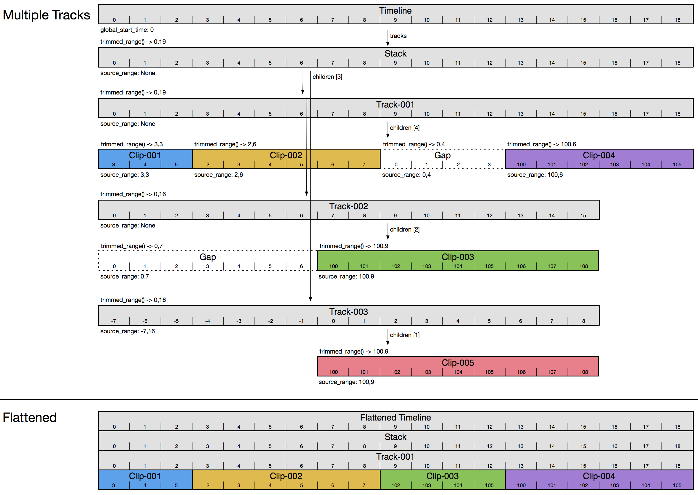

# Timeline Structure

An OpenTimelineIO `Timeline` object can contain many tracks, nested stacks, 
clips, gaps, and transitions. This document is meant to clarify how these 
objects nest within each other, and how they work together to represent an
audio/video timeline.

## Rendering

Rendering of the image tracks in a timeline is done in painter order. The layers
in a stack are iterated from the bottom (the first entry in the stack) towards
the top (the final entry in the stack). Images in a stack overlay lower images
using an alpha composite operation respecting any alpha in the source materials.

Within a track, clips may overlap via a transition. In that case, the 
contribution of track is the linear blend of the elements joined by the
transition.

If there are effects on a clip, OpenTimelineIO does not say anything about the
impact of the effect and deviation from the base behavior is application
specific.

Rendering of the audio tracks is additive. It is strongly advised, but not
required, that the summed audio is summed as floating point, and that it is 
processed through a compression filter in order to prevent clipping and 
distortion. 

## Simple Cut List

Let’s start with a simple cut list of a few clips. This is stored as a 
single `Timeline` with a single `Track` which contains several `Clip` children,
spliced end-to-end.

*Figure 1 - Simple Cut List*

Since a `Timeline` can hold multiple tracks, it always has a top-level `Stack` 
object to hold its `Track` children. In this case, that `Stack` has just one
`Track`, named “Track-001”.

Within "Track-001", there are four `Clip` objects, named "Clip-001", "Clip-002", 
"Clip-003", and "Clip-004". Each `Clip` has a corresponding media reference, 
"Media-001", "Media-002", etc.

At the bottom level, we see that each media reference has a target_url and 
an available_range. The target_url tells us where to find the media (e.g. 
a file path or network URL, etc.) The available_range specifies the range 
of media that is available in the file that it points to. An available_range
is a `TimeRange` object which specifies a start_time and duration. The 
start_time and duration are each `RationalTime` objects, which store a 
value and rate. Thus we can use `RationalTime(7,24)` to mean frame 7 at 24 
frames per second. In the diagram we write this as just 7 for brevity.

In this case most of our media references have an available_range that 
starts at 0 for some number of frames. One of the media references starts 
at 100. Assuming the media is 24 frames per second, this means that the 
media file contains media that starts at 4 seconds and 4 frames (timecode 
00:00:04:04).

In many cases you might not know the available_range because the media is 
missing, or points to a file path or URL which might be expensive to query.
If that’s the case, then the available_range of a media_reference will be 
`None`.

Above the media references, we see that each `Clip` has a source_range, which 
specifies a trimmed segment of media. In cases where we only want a portion 
of the available media, the source_range will start at a higher start_time, 
and/or have a shorter duration. The colored segments of "Media-001", "Media-002"
and "Media-003" show the portion that each clip’s source_range references.

In the case of "Clip-004", the source_range is `None`, so it exposes its entire 
media reference. In the OTIO API, you can query the trimmed_range() of a 
clip to get the range of media used regardless of whether it has a 
source_range, available_range or both - but it needs at least one of the 
two.

Also note that a clip’s source_range could refer to a segment outside the 
available_range of its media reference. That is fine, and comes up in 
practice often (e.g. I only rendered the first half of my shot). OTIO 
itself does no snapping or verification of this, but downstream 
applications may handle this in a variety of ways.

The single `Track` in this example contains all four clips in order. You 
can ask the `Track` or `Stack` for its trimmed_range() or duration() and it 
will sum up the trimmed lengths of its children. In later examples, we 
will see cases where a `Track` or `Stack` is trimmed by setting a source_range, 
but in this example they are not trimmed.

## Transitions

A `Transition` is a visual effect, like a cross dissolve or wipe, that blends
two adjacent items on the same track. The most common case is a fade or
cross-dissolve between two clips, but OTIO supports transitions between
any two `Composable` items (`Clip`s, `Gap`s, or nested `Track`s or `Stack`s).

*Figure 2 - Transitions*

In Figure 2, there is a `Transition` between "Clip-002" and "Clip-003". The in_offset
and out_offset of the `Transition` specify how much media from the adjacent
clips is used by the transition.

Notice that the `Transition` itself does not make "Track-001" any shorter or
longer. If a playback tool is not able to render a transition, it may
simply ignore transitions and the overall length of the timeline will
not be affected.

In Figure 2, the `Transition`'s in_offset of 2 frames means that frames 1 and 2 of "Media-003" are used in the cross dissolve.
The out_offset of 3 frames means that frames 8, 9, 10 of "Media-002" are used.
Notice that "Media-002"'s available_range is 2 frames too short to
satisfy the desired length of the cross-dissolve. OTIO does not
prevent you from doing this, as it may be important for some use cases. OTIO
also does not specify what a playback tool might display in this case.

A `Transition`'s in_offset and out_offset are not allowed to extend beyond
the duration of the adjacent clips. If a clip has transitions at both
ends, the two transitions are not allowed to overlap. Also, you cannot
place two transitions next to each other in a track; there must be a
composable item between them.

A fade to or from black will often be represented as a transition
to or from a `Gap`, which can be 0 duration. If multiple tracks are present
note that a `Gap` is meant to be transparent, so you may need to consider
using a `Clip` with a `GeneratorReference` if you require solid black or any
other solid color.

## Multiple Tracks

A more typical timeline will include multiple video tracks. In Figure 3, 
the top-level `Stack` now contains "Track-001", "Track-002", and "Track-003" which 
contain some `Clip` and `Gap` children. Figure 3 also shows a flattened copy of the 
timeline to illustrate how multitrack composition works.

*Figure 3 - Multiple Tracks*

The `Gap` in "Track-001" is 4 frames long, and the track below, "Track-002", has 
frames 102-105 of "Clip-003" aligned with the `Gap` above, so those frames 
show through in the resulting flattened `Track`.

Note that the `Gap` at the front of "Track-002" is used just to offset "Clip-003".
This is a common way to shift clips around on a track, but you may also 
use the `Track`’s source_range to do this, as illustrated in "Track-003".

"Clip-005" is completely obscured by "Clip-003" above it, so "Clip-005" does not 
appear in the flattened timeline at all.

You might also notice that "Track-001" is longer than the other two. If you 
wanted "Track-002" to be the same length, then you would need to append a `Gap` 
at the end. If you wanted "Track-003" to be the same length, then you could 
extend the duration of its source_range to the desired length. In both 
cases, the trimmed_range() will be the same.

## Nested Compositions

The children of a `Track` can be any `Composable` object, which includes 
`Clip`s, `Gap`s, `Track`s, `Stack`s, and `Transition`s. In Figure 4 we see an 
example of a `Stack` nested within a `Track`.

*Figure 4 - Nested Compositions*

In this example, the top-level `Stack` contains only one `Track`. "Track-001"
contains four children, "Clip-001", "Nested Stack", "Gap", and "Clip-004". By 
nesting a `Composition` (either `Track` or `Stack`) we can refer to a 
`Composition` as though it was just another `Clip` in the outer `Composition`. 
If a source_range is specified, then only a trimmed segment of the inner 
`Composition` is included. In this case that is frames 2 through 7 of 
"Nested Stack". If no source_range is specified, then the full 
available_range of the nested composition is computed and included in 
the outer composition.

"Nested Stack" contains two tracks, with some clips, gaps, and a track-level 
source_range on the lower track. This illustrates how the content of 
"Nested Stack" is composed upwards into "Track-001" so that a trimmed portion 
of "Clip-005" and "Clip-003" appear in the flattened composition.

Notice how the `Gap` in "Track-001" cannot see anything inside the nested 
composition ("Clip-003", etc.) because those are not peers to "Track-001", 
they are nested within "Nested Stack" and do not spill over into adjacent 
`Gap`s. In other words, "Nested Stack" behaves just like a `Clip` that happens 
to have complex contents rather than a simple media reference.

